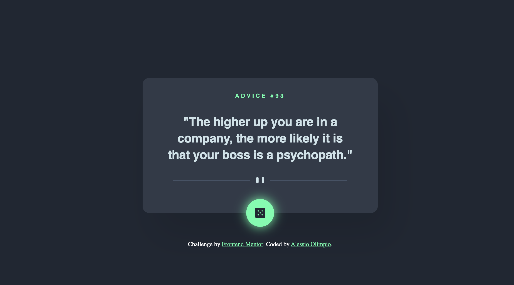

# Frontend Mentor - Advice generator app solution

This is a solution to the [Advice generator app challenge on Frontend Mentor](https://www.frontendmentor.io/challenges/advice-generator-app-QdUG-13db). Frontend Mentor challenges help you improve your coding skills by building realistic projects.

## Table of contents

- [Overview](#overview)
  - [The challenge](#the-challenge)
  - [Screenshot](#screenshot)
  - [Links](#links)
- [My process](#my-process)
  - [Built with](#built-with)
  - [What I learned](#what-i-learned)
  - [Useful resources](#useful-resources)
- [Author](#author)

## Overview

### The challenge

Users should be able to:

- View the optimal layout for the app depending on their device's screen size
- See hover states for all interactive elements on the page
- Generate a new piece of advice by clicking the dice icon

### Screenshot

### Links

- Solution URL: [Solution URL](https://github.com/alessiooli/advice-generator-responsive-app)
- Live Site URL: [Add live site URL here](https://your-live-site-url.com)

## My process

Firstly I defined CSS custom properties, then I defined the layout with HTML5 and implemented the Advice Slip API with Javascript, using the Fetch API.

### Built with

- Semantic HTML5 markup
- CSS custom properties
- Flexbox
- Mobile-first workflow
- Javascript

### Useful resources

- [Mozilla MDN](https://developer.mozilla.org/en-US/) 

## Author

- Website - [Alessio Olimpio](https://www.alessioolimpio.com/)
- Frontend Mentor - [@alessiooli](https://www.frontendmentor.io/profile/alessiooli)
- Instagram - [@alessio.olimpio](https://www.instagram.com/alessio.olimpio/)

 
